# DYNO

## Application Description
This is an social media application that allows bouldering and rock climbing enthusiasts to connect, share photo/video and seek for help of climbing routes. 

## User Stories
1. User is able to share photo or video in a post visible by other users
2. User is able to interact with post by other users by comment and like
3. User is able to seek help of the climbing routes by tagging the posts
4. User is able to follow other users
5. User is able to search posts by tags, location & other user name

## Technology Used

1. Node.js (Back end server)
2. MongoDB (NoSQL Database of application)
3. Mongoose (ODM library to interact with MongoDB)
4. Bcrypt (Hash password)
5. Express-session (Store current state of browsing session)
6. Heroku (Deployment of application)
7. Jquery (Front end interactive UI)
8. Ajax
9. Cloudinary (Cloud storage of uploaded images and videos by users)
10. Materialize Material Design Framework (CSS framework for general design of application)
11. Tinymce API (Add functionality on UI for emoticons entering)

## Link to Live Site

[DYNO](https://dyno-climbing.herokuapp.com/)

## Approach 
- Start with planning and design of full application flow according to the user stories
- Determine schema and routes of application flow with indication before & after authentication layer
- Set up MVC structures and dependencies
- Set up database and model
- Create authentication layer with simple wireframe
- Proceeds with implementation of each of the routes with testing
- Deploy to Heroku

## Routes

| # | Action  | URL                        | HTTP Verb | Views               |
|---|---------|----------------------------|-----------|---------------------|
| 1 | Index   | /                          | GET       | index.ejs           |
|   |         | /home                      | GET       | app/index.ejs       |
|   |         | /following                 | GET       | app/posts/index.ejs |
|   |         | /users/:name/followers     | GET       | users/index.ejs     |
|   |         | /users/:name/following     | GET       | users/index.ejs     |
|   |         | /posts/:id/like            | GET       | users/index.ejs     |
|   |         | search?q=  &cat=           | GET       | app/index.ejs       |
|   |         | search/following?q=  &cat= | GET       | app/posts/index.ejs |
| 2 | Show    | /users/:name               | GET       | users/show.ejs      |
|   |         | /posts/:id                 | GET       | app/posts/show.ejs  |
| 3 | New     | /users/new                 | GET       | users/new.ejs       |
|   |         | /login                     | GET       | sessions/new.ejs    |
|   |         | /posts/new                 | GET       | app/posts/new.ejs   |
| 4 | Create  | /users                     | POST      | none                |
|   |         | /login                     | POST      | none                |
|   |         | /posts                     | POST      | none                |
| 5 | Edit    | /accounts/edit             | GET       | users/edit.ejs      |
|   |         | /posts/:id/edit            | GET       | app/posts/edit.ejs  |
| 6 | Update  | /users/                    | PUT       | none                |
|   |         | /posts/:id                 | PUT       | none                |
|   |         | /posts/:id/comment         | PUT       | none                |
|   |         | /posts/:id/like            | PUT       | none                |
|   |         | /posts/:id/unlike          | PUT       | none                |
|   |         | /users/:name/follow        | PUT       | none                |
|   |         | /users/:name/unfollow      | PUT       | none                |
| 7 | Destroy | /sessions                  | DELETE    | none                |
|   |         | /posts/:id                 | DELETE    | none                |

## App Details

1. Landing page before authentication layer, new user or existing users will be redirected to this page if they try to access other routes without login.

2. Log in and sign up page, whereby username & password (encrypted with bcrypt) is stored in User model. Error message will be prompted, if username, password do not comply. 

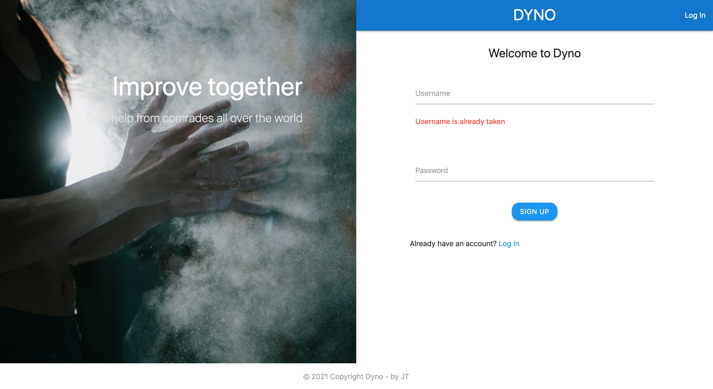

3. Once user logs in successfully, it will be directed to home page, whereby all posts by all users are display in chronological order with latest post displayed first. 

Infinite scrolling is implemented, whereby only certain number of posts (set at 12) are fetched to display on home page. When user scrolls to the end of window, event listener and ajax call fetch next batch data to display on webpage. This is implemented, so that the application is scalable (when posts created by users are significant, it will slow down page loading if all data is sent all at once).

Sticky button at the bottom, allows user to have quick access to certain tool that most likely to be used. 

Padding of image with blurring background provides a clean UI, where all posts look consistent in size.

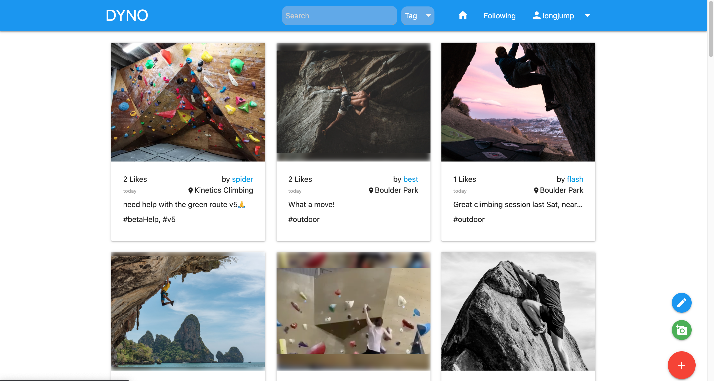

4. If user follows other users, he/she can easily find all the posts of following users by clicking on the "Following tab" 

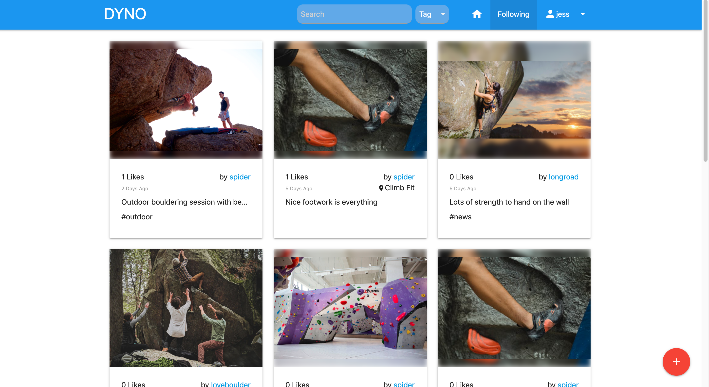

5. Navigation and menu are kept to be simple, and icons are used for user to easily identify the function. 

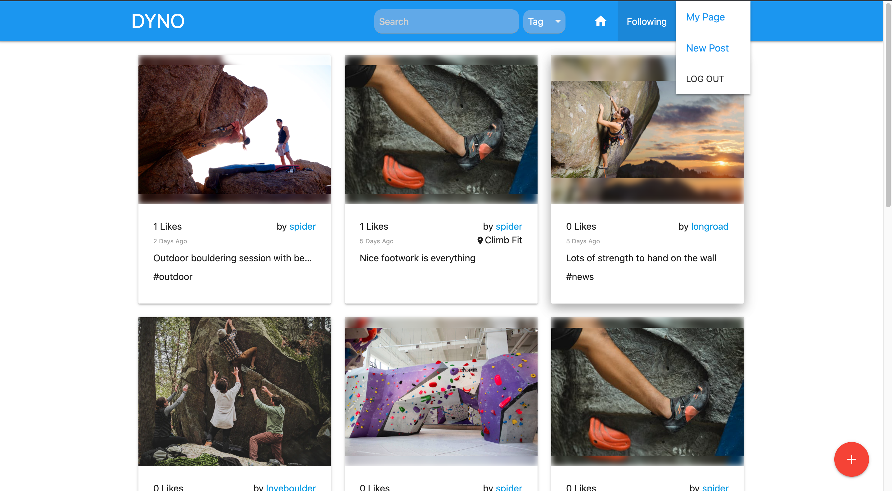

6. User can search post by post author, tag and location. This can be filtered according to users that he/she is following. 

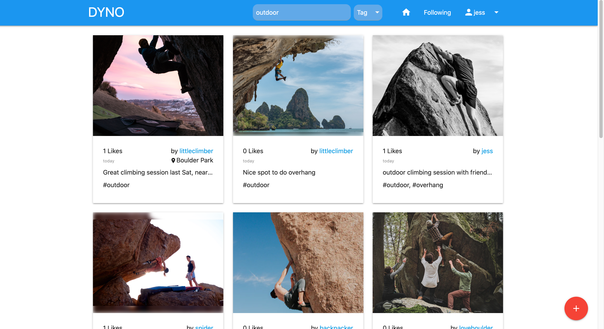

7. After user clicks on the post, more details of the post will be revealed on another route. 

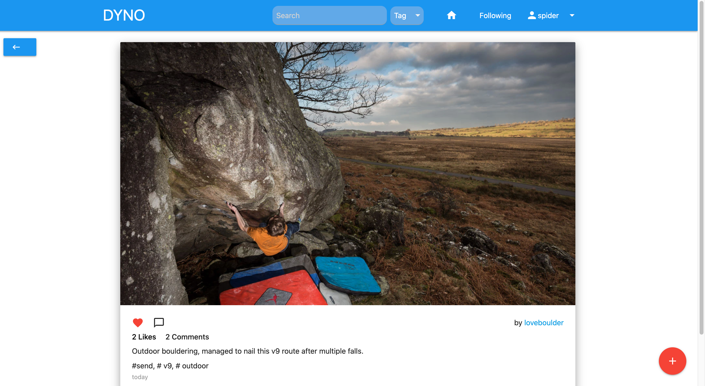

8. User is able to comment and like posts by others. The UI is kept to be intuitive, and jquery with event listener is used to implement it. 

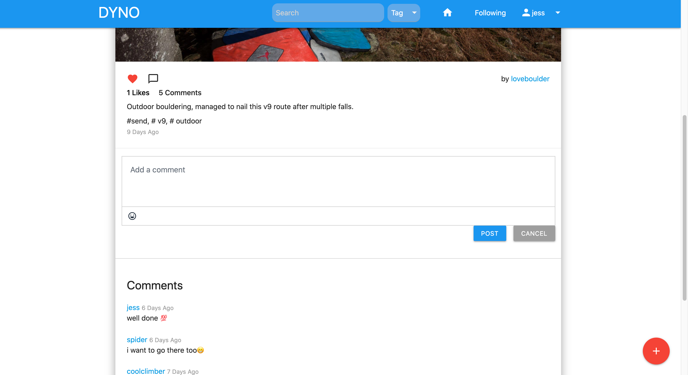

9. User can create a new post, by uploading image or video from their device. Tagging by chip with autocomplete options is implemented. 
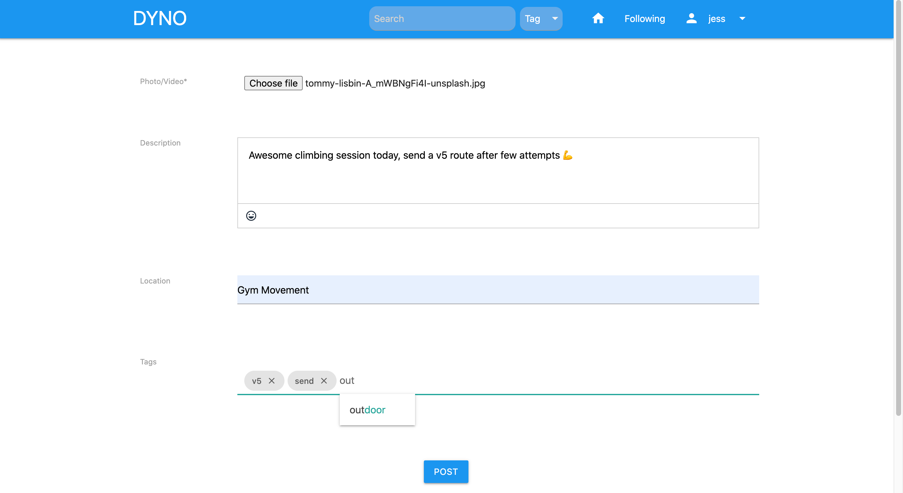

10. This show user profile page. If profile page belongs to current logged in user, edit profile button will be available for profile edit. Otherwise, "Follow" or "Unfollow" buttons are available 

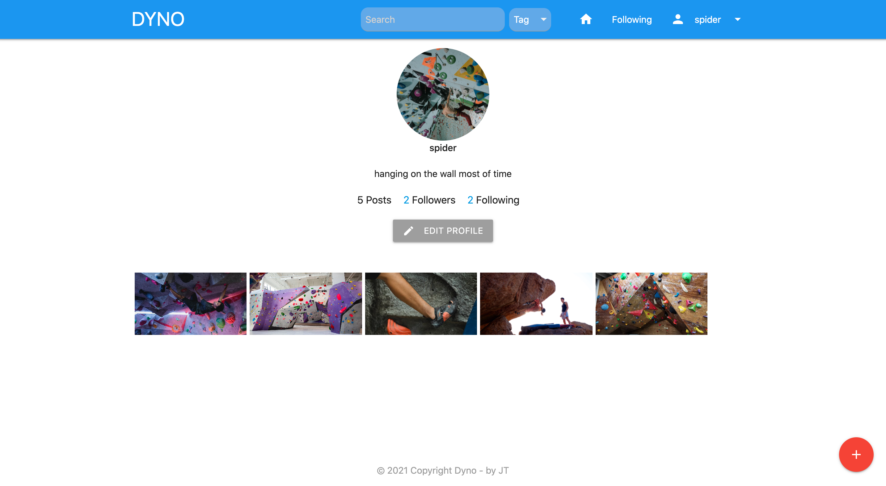

11. Clicking on follower or following link, will display the relevant list. 

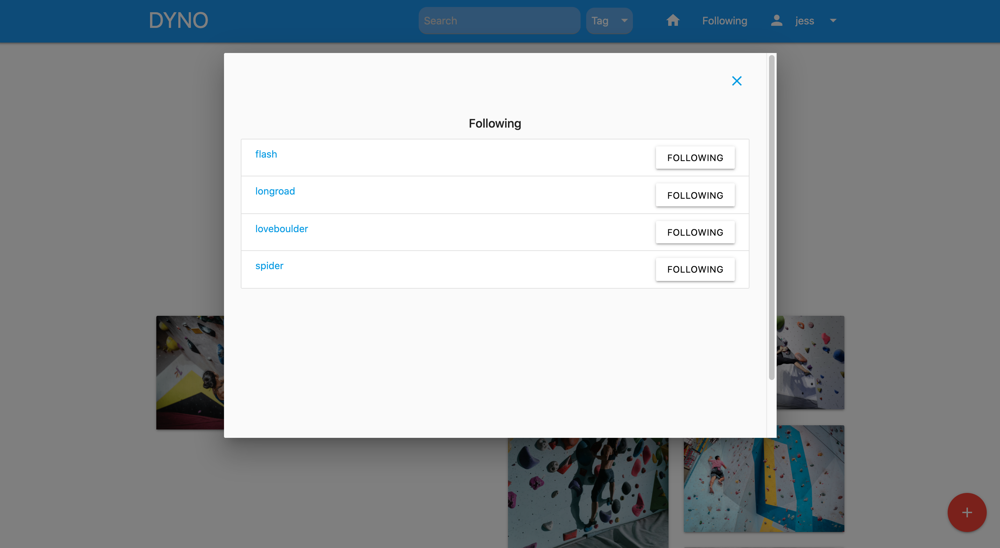

12. Mobile first responsive design

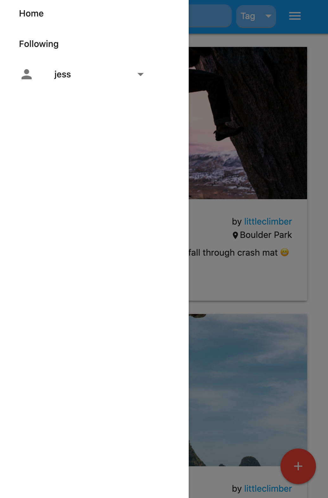

## Technical Challenges
1. Flexibility of customize look of application is compromised when using css framework, a few features that I tried to implement overlap with framework, and need to think of ways for walk-around.

## Accomplishments 
1. Developed a full stack application with intuitive UI
2. Used a CSS framework for frond end design, and able to customize with own CSS code
3. Implemented image and video uploading with Cloudinary, instead of requesting users to provide url
4. Implemented infinite scrolling
5. Used AJAX for some of the routes

## Future Features

* Upload image to Cloudinary directly from browser, instead sending through backend server. Exploring using other more common cloud server AWS for holding image and video data
* Direct access to camera for photo capture and video recording
* Inclusion of map, so that user can find other users nearby and any recent posts related to gyms that he/she is visiting (able to see others beta / solution to climbing route)
* Training section, whereby user can log training with photos, and can select which photos to posts. So, there is private & public division for each user. Analytics of training logs.
* Recommended posts based on popularity & interest
* Send notification to users when their following users share a post
* Able to reply to comment
* Authentication with google account
* Password resetting with email

  